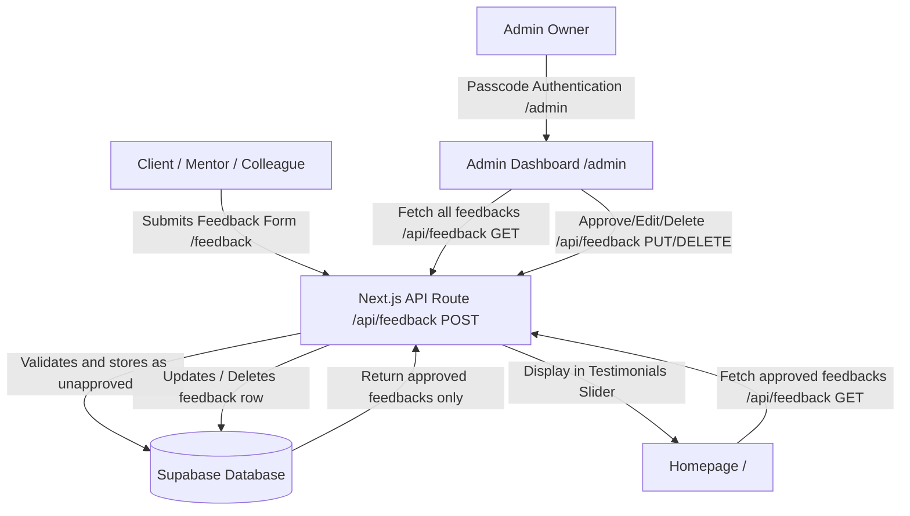

# Abiola John Oluwaseyi — Portfolio

A premium, production-ready developer portfolio website built with **Next.js 15 (App Router)**, **TypeScript**, **Tailwind CSS v4**, and **Framer Motion v12**. 

This portfolio showcases professional software engineering projects, experience, skills, and features a dynamic client feedback system powered by a serverless database integration.

---

## 📷 Visual Showcase

*Below are placeholders for the project screenshots. Replace the files at the specified paths to update the images:*

<!-- PLACEHOLDER 1: Portfolio Home Page -->
### 🌐 Portfolio Homepage


<!-- PLACEHOLDER 2: Feedback Admin Moderation Dashboard -->
### 🔐 Feedback Admin Dashboard


---

## ⚡ Key Features

- ⚛️ **Modern Tech Stack**: Harnesses Next.js 15, TypeScript, Tailwind CSS v4, and Framer Motion v12.
- 🎨 **Custom Theme Engine**: Seamless, persistent dark/light mode toggle with native local storage synchronization (independent of external wrappers to prevent hydration mismatches).
- 📂 **Rich Case Studies**: In-depth breakdowns of featured projects (Ogbomoso Tech Ignite, Acta, Acadexis, QuillInsight) including problems, solutions, and architectural impact.
- 💬 **Dynamic Testimonials (Supabase integration)**:
  - Public submission portal at `/feedback` where clients, colleagues, and mentors can leave rated reviews.
  - Interactive homepage slider that fetches and cycles through verified testimonials.
- 🛡️ **Secure Moderation Dashboard (`/admin`)**:
  - Secure page requiring a custom passcode header.
  - Interactive dashboard allowing the admin to **approve**, **edit details**, or **delete** submitted feedback in real-time.
- 📬 **Email Integration**: Integrated Contact Form connected directly to EmailJS for instant delivery to the developer's inbox.

---

## 🛠️ Architecture & Workflow

The diagram below details the client review lifecycle from submission, admin moderation, to public showcase:



---

## 📁 Project Structure

```
portfolio/
├── app/
│   ├── admin/
│   │   └── page.tsx          # 🔐 Admin feedback moderation panel
│   ├── api/
│   │   └── feedback/
│   │       └── route.ts      # ⚡ CRUD API (GET, POST, PUT, DELETE) handling Supabase calls
│   ├── feedback/
│   │   └── page.tsx          # 💬 Public client feedback form page
│   ├── layout.tsx            # Global layout, fonts, and meta tags
│   ├── page.tsx              # Main homepage assembly (Hero, About, Projects, Experience, Contact)
│   └── globals.css           # CSS variables, custom theme tokens & utilities
├── components/
│   ├── About.tsx             # Interactive bio section
│   ├── AdminFeedback.tsx     # Moderation table and passcode validation logic
│   ├── Contact.tsx           # Contact form (EmailJS powered)
│   ├── Experience.tsx        # Career timeline + Testimonial slider
│   ├── Feedbacks.tsx         # Client feedback submission component
│   ├── Footer.tsx            # Credits and social connections
│   ├── Hero.tsx              # Animated introduction section
│   ├── Navbar.tsx            # Responsive, glassmorphic navigation header
│   ├── Projects.tsx          # Case study cards
│   ├── Skills.tsx            # Dynamic skills catalog
│   └── ThemeProvider.tsx     # Light/Dark mode state context
├── lib/
│   ├── apiService.ts         # Client-side validation & local feedback utilities
│   ├── data.ts               # ← EDIT THIS FILE to update static content (info, skills, projects)
│   ├── schema.sql            # Database schema for Supabase
│   └── supabaseClient.ts     # Lightweight Supabase client using native fetch api
└── package.json
```

---

## ⚙️ Environment Configuration

To run the application locally or in production, create a `.env` file in the root directory (based on `.env.example`):

```bash
# EmailJS configuration (for Contact Form)
NEXT_PUBLIC_EMAILJS_SERVICE_ID=your_emailjs_service_id
NEXT_PUBLIC_EMAILJS_TEMPLATE_ID=your_emailjs_template_id
NEXT_PUBLIC_EMAILJS_PUBLIC_KEY=your_emailjs_public_key

# Passcode authentication for the /admin dashboard
ADMIN_PASSCODE=your_secret_admin_passcode

# Supabase REST endpoint credentials (for Dynamic Testimonials)
NEXT_PUBLIC_SUPABASE_URL=https://your-project-id.supabase.co
NEXT_PUBLIC_SUPABASE_ANON_KEY=your-supabase-anon-key
SUPABASE_SERVICE_ROLE_KEY=your-supabase-service-role-key
```

---

## 🗄️ Database Setup (Supabase)

The feedback feature operates on a `feedbacks` table inside Supabase. Use the query editor in your Supabase dashboard to execute the SQL schema defined in [lib/schema.sql](file:///d:/oluwaseyiae/lib/schema.sql):

```sql
create table feedbacks (
  id uuid default gen_random_uuid() primary key,
  created_at timestamp with time zone default timezone('utc'::text, now()) not null,
  name text not null,
  email text not null,
  role_title text not null,
  company text not null,
  project_type text not null,
  rating integer not null check (rating >= 1 and rating <= 5),
  feedback_text text not null,
  valuable_part text not null,
  linkedin_url text,
  approved boolean default false not null,
  allow_public_display boolean default true not null
);

-- Enable Row Level Security (RLS)
alter table feedbacks enable row level security;

-- Create Policies
create policy "Allow public inserts" on feedbacks 
  for insert to anon 
  with check (true);

create policy "Allow public read of approved feedback" on feedbacks 
  for select to anon 
  using (approved = true);
```

---

## 🚀 Getting Started

### 1. Clone the project and install dependencies
```bash
npm install
```

### 2. Run the development server
```bash
npm run dev
```
Open [http://localhost:3000](http://localhost:3000) with your browser to see the result.

### 3. Build & Deploy
To compile the production build:
```bash
npm run build
```

To run the production bundle locally:
```bash
npm run start
```

Deploy the project on **Vercel** with a single command:
```bash
npx vercel --prod
```
*Note: Make sure to copy all environment variables to the Vercel project settings.*

---

Built with ❤️ and a commitment to **Holiness & Excellence**.
